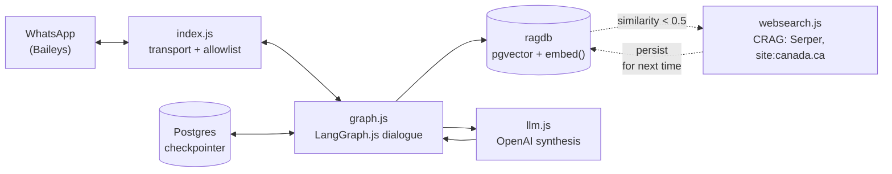

# ircc-whatsapp-bot

[](https://github.com/kattakath/ircc-whatsapp-bot/actions/workflows/ci.yml)
[](./LICENSE)
[](https://nixos.org)
[](https://docs.langchain.com/oss/javascript/langgraph)

A WhatsApp bot that answers Canadian immigration questions grounded in
official IRCC (canada.ca) pages, via a local pgvector RAG store. Built to
informally help a friend explore her options — not a licensed immigration
consulting tool. See "Legal boundary" below.



## How it works

- **Retrieval**: `src/db.js` queries the `docs` table in the local `ragdb`
  Postgres database (see `nix-local-rag`) for the IRCC page chunks closest
  to the question, using the in-DB `embed()` function (local Ollama,
  nothing leaves the machine at the retrieval step).
- **Web fallback (CRAG)**: `src/websearch.js` implements a simplified
  [Corrective RAG](https://docs.langchain.com/oss/python/langgraph/agentic-rag)
  pattern — `graph.js`'s `answerFreeform()` grades local retrieval by top
  cosine-similarity (`GRADE_THRESHOLD = 0.5`, stricter than `db.js`'s own
  noise-filtering `SIMILARITY_FLOOR = 0.3`); below that, local results are
  **discarded** (not blended) in favor of a live, `site:canada.ca`-scoped
  search via [Serper.dev](https://serper.dev). This exists specifically to
  avoid the LLM falling back to ungrounded parametric knowledge when local
  retrieval is weak — the fallback is always another official source, never
  open-web or the model's own trained knowledge (the system prompt in
  `llm.js` forbids that regardless). Self-learning: a successful web-fallback
  answer's content is persisted into `ragdb` under `source="ircc-live"`, so
  a similar future question is answered from local retrieval instead of
  triggering another live search. Requires `SERPER_API_KEY`; without it, web
  fallback silently no-ops and the existing "I don't have that info" answer
  is used instead.
- **Synthesis**: `src/llm.js` sends the retrieved chunks + question to the
  OpenAI API (`gpt-5.5`, a few seconds per reply — via the Responses API,
  `client.responses.create`, which also works for the "-pro" tier if you
  ever want to swap back up) and asks it to answer *only* from that
  content, formatted for WhatsApp (short bullet points with emoji anchors,
  not prose paragraphs — the established chatbot/conversational-UI writing
  pattern), with citations. This step does leave the machine (OpenAI API).

  **Model choice is deliberate, not a default**: `gpt-5.5-pro` (30-90s per
  reply) was the original pick for "highest intelligence," but the system
  audit found this in direct tension with the actual audience — W3C's COGA
  cognitive-accessibility guidelines specifically flag fatigue during
  multi-step waits, and a 30-90s silence risks losing her attention
  entirely regardless of how good the eventual answer is. Switched to the
  faster tier after weighing that tradeoff explicitly. `index.js` still
  sends an early "still working on it" filler for the cases that do run
  long (e.g. the CRAG web-fallback path doing a live search + fetch on top
  of the LLM call), so the mitigation stays as a safety net either way.
- **Dialogue**: `src/graph.js` is an adaptive, branching intake — a short
  menu (visit / study / work / PR / citizenship / something else), numbered
  quick-reply options instead of free typing where it matters, and a
  graceful fallback: if a reply doesn't match what's expected, it's treated
  as a real question and answered directly rather than rejected as invalid
  input. For the PR and citizenship branches, it collects a few basic facts
  (age, education, language self-rating, etc.) and asks the LLM to compare
  that rough profile against the real IRCC eligibility criteria already in
  the RAG store — clearly labeled as an informal, non-official read.

  This is built as a [LangGraph.js](https://docs.langchain.com/oss/javascript/langgraph)
  `StateGraph`, not a hand-rolled state machine — each menu/prompt step is a
  node that pauses on `interrupt()` waiting for the next WhatsApp message,
  and conversation state is checkpointed to Postgres (`ragdb`, via
  `@langchain/langgraph-checkpoint-postgres`'s `PostgresSaver`), keyed by
  WhatsApp JID as the LangGraph `thread_id`. This means a conversation
  (including mid-intake, e.g. she's answered 3 of 6 PR questions) survives
  the bot process crashing or restarting — verified in
  `src/simulate.js` by compiling a fresh graph instance mid-conversation
  and confirming it resumes correctly from the last checkpoint.

  **Important constraint this depends on**: graph nodes must have no I/O
  side effects (no sending WhatsApp messages) before their `interrupt()`
  call — on resume-after-crash, LangGraph re-executes a node from its top,
  so a side effect there would double-fire. Nodes only call
  `retrieve()`/`synthesize()` (safe to redo) and return data; `src/index.js`
  is solely responsible for actually sending messages, based on the graph's
  output.
- **Transport**: `src/index.js` connects to WhatsApp via
  [Baileys](https://github.com/WhiskeySockets/Baileys), an *unofficial*
  WhatsApp Web protocol client (see risk note below).

## Why LangGraph, not a hand-rolled state machine

The dialogue engine originally was a hand-rolled JSON-file-backed state
machine (`dialogue.js`/`state.js`, now removed). It had a real bug: session
state got cleared *before* the slow LLM synthesis call completed, so a
process crash during that ~30-90s window silently lost a user's entire
collected profile (age, education, etc.) with no recovery. Research into
whether this was reinventing an already-solved problem found: full
migration to a framework (LangGraph, Temporal) is more infrastructure than
a single-friend prototype needs, but LangGraph's checkpointing *pattern* —
persist state at every step, resumable across process restarts — directly
solves this exact bug. Since this was worth doing regardless of scale, the
whole dialogue engine now runs on LangGraph.js with `PostgresSaver`
checkpointing against the already-running `ragdb` Postgres, rather than
reimplementing that pattern by hand.

## Setup

```sh
npm install
```

Environment variables:
- `OPENAI_API_KEY` — required (already set in this shell's env).
- `OPENAI_MODEL` — optional, defaults to `gpt-5.5` (a few seconds per
  reply). Set to `gpt-5.5-pro` for deeper reasoning at the cost of 30-90s
  per reply — no code change needed either way, `client.responses.create`
  works for both tiers.
- `RAGDB_URI` — optional, defaults to `postgresql://mcp@127.0.0.1:5433/ragdb`.
- `SERPER_API_KEY` — optional but needed for CRAG web fallback (see above);
  free tier at [serper.dev](https://serper.dev). Without it, weak local
  retrieval just falls through to the existing "I don't have that info"
  answer instead of searching canada.ca live.
- `ALLOWED_NUMBERS` — optional but recommended once this is live: a
  comma-separated allowlist of phone numbers (digits only, e.g.
  `15145551234`) permitted to talk to the bot. Unset = replies to anyone
  who messages the linked number.

## Pairing WhatsApp — use a SPARE number, not your friend's main one

Baileys links to a real WhatsApp account by scanning a QR code, the same
way "Linked Devices" works in the WhatsApp app. This is **not** the
official WhatsApp Business API — it's an unofficial protocol client, which
is against WhatsApp's Terms of Service. Meta does detect and ban accounts
that behave like automated clients. If the linked number is someone's
primary daily-driver number, a ban takes out their real WhatsApp too.

**Use a spare number / secondary SIM for this**, not her main line.

1. `npm start`
2. A QR code prints in the terminal.
3. On the spare-number phone: WhatsApp → Settings → **Linked Devices** →
   **Link a Device** → scan the QR code.
4. Once connected you'll see `WhatsApp connected. Listening for messages...`.
   Session credentials are saved to `auth/` (gitignored) so it stays linked
   across restarts — no need to rescan every time.
5. Message that number from her phone to start the conversation.

To test the retrieval+synthesis pipeline without touching WhatsApp at all:

```sh
node src/test-pipeline.js "How to come to Canada?"
```

To simulate a full conversation (including the PR/citizenship intake) with
no WhatsApp connection — a message literally equal to `__RESTART__`
simulates a process crash (compiles a fresh graph instance mid-conversation,
same checkpointer/thread) to verify state survives it:

```sh
node src/simulate.js "hi" "4" "29" "__RESTART__" "4" "3" "3" "no" "no"
```

## Keeping it running

Manually, this is a foreground Node process — `npm start` and leave the
terminal open. For anything more permanent, see the Nix flake below, which
supervises it declaratively (auto-restart on crash/reboot) instead.

## Nix

This repo is a self-contained flake — packages + devShell + a home-manager
service module — so any Nix system can run this bot from a one-line flake
input, no manual `npm install` or hand-written service unit needed.

```sh
nix build            # .#default — a real buildNpmPackage derivation
nix develop          # devShell: nodejs + psql, for local dev/debugging
```

Supported systems: `x86_64-linux`, `aarch64-linux`, `aarch64-darwin`
(`x86_64-darwin` is excluded — nixpkgs-unstable dropped it entirely).

**As a service**, from a consuming flake:

```nix
{
  inputs.ircc-whatsapp-bot.url = "github:kattakath/ircc-whatsapp-bot";
  inputs.ircc-whatsapp-bot.inputs.nixpkgs.follows = "nixpkgs";
  # ... in your home-manager modules:
  #   ircc-whatsapp-bot.homeManagerModules.default
  #   { services.irccWhatsappBot = {
  #       enable = true;
  #       allowedNumbers = [ "15145551234" ]; # real numbers -- keep this in a private flake
  #       localRag.enable = true; # no Postgres of your own yet? see below
  #     }; }
}
```

See `nix/module.nix` for the full option surface (`package`, `stateDir`,
`model`, `langsmithTracing`/`langsmithProject`, `ragdbUri`, `localRag.enable`,
`environmentFile`). Secrets (`OPENAI_API_KEY`/`SERPER_API_KEY`/
`LANGCHAIN_API_KEY`) are never read from Nix: set `environmentFile` to a
`KEY=value` file outside Nix (required on Linux), or on Darwin leave it
unset to fall back to login-Keychain lookups. Runs under `launchd` on
Darwin, `systemd --user` on Linux (Linux path is real but untested — no
Linux host runs this today).

**The RAG database dependency**: this bot needs a reachable Postgres with
pgvector and an `embed(text)` SQL function (see "What's in the RAG store" —
actually the section below on setup). That's genuinely third-party
infrastructure, not something bundled into this flake — bundling it in would
mean any host running something *else* that also needs Postgres/Ollama (a
real case: this repo's own author also runs a separate voice-assistant tool
against the same local Ollama) ends up with two redundant, possibly
conflicting instances. Instead, following the same
`services.<app>.database.createLocally` idiom nixpkgs itself uses (see e.g.
`services.paperless.database.createLocally`):
- **Already have a compatible Postgres?** Leave `localRag.enable` at its
  default (`false`) and point `ragdbUri` at it.
- **Starting from nothing?** Set `localRag.enable = true` — this module
  always imports [nix-local-rag](https://github.com/kattakath/nix-local-rag)
  (a separate, independently reusable flake: pgvector + Ollama, launchd/
  home-manager, no API key, nothing leaves the machine) and, when enabled,
  turns on its `services.pgvectorLocal`/`services.ollamaLocal` for you.
  `ragdbUri` already defaults to that service's own connection string, so
  no further config is needed either way.

**Caution**: never run the built binary (or `nix build`'s `result/`) from a
directory that holds a *live, paired* `auth/` session while that session's
real bot process is also running — Baileys/WhatsApp treats it as a second
device on the same credentials and will force both connections to
re-pair. The packaged deployment avoids this by running from an isolated
`stateDir` (default `~/.local/state/ircc-whatsapp-bot`), separate from any
manual checkout's `auth/`.

## What's in the RAG store right now

**3,170 chunks** from **300 official canada.ca IRCC pages**, crawled via the
Apify `apify/website-content-crawler` actor from the 5 top-level `/services/`
hub pages (citizenship, immigrate/PR, study, work, visit), scoped to
`.../services/**` (depth 3, capped at 300 pages — deliberately bounded, not
the entire canada.ca domain, to avoid diluting retrieval with press
releases/corporate content). Adaptive rendering handles JS-heavy pages
properly, unlike the original plain-fetch ingestion.

Each chunk is tagged with a per-topic `source` derived from its URL path
(`ircc-crawl-citizenship`, `ircc-crawl-pr`, `ircc-crawl-study`,
`ircc-crawl-work`, `ircc-crawl-visit`, `ircc-crawl-refugees`,
`ircc-crawl-passports`, `ircc-crawl-other` for everything else under
`/services/` — mostly application forms/guides) — `graph.js`'s
`TOPIC_BRANCHES`/`BRANCH_SOURCES` filter retrieval by these exact tags, so
if you re-crawl, keep the tag scheme in sync with `scripts/ingest-crawl.js`'s
`TOPIC_MAP`, or the menu branches will silently return no results.

**Staleness risk**: this content changes — the initial crawl already picked
up a December 2025 legal change (Bill C-3) and 2026 travel restrictions.
Without a refresh, an answer that's accurate today can quietly go stale.

**To re-crawl and re-ingest manually**:
```sh
node scripts/recrawl.js
```
Standalone — triggers the Apify actor via its REST API (needs
`APIFY_TOKEN` in `.env`), polls for completion, downloads the dataset, and
runs it through `ingest-crawl.js` (which clears all existing `ircc-crawl-*`
rows first, so it's safe to re-run). No interactive MCP tools needed.

**To run it automatically, monthly**:
```sh
cp scripts/com.ismailkattakath.ircc-whatsapp-bot.recrawl.plist ~/Library/LaunchAgents/
launchctl load ~/Library/LaunchAgents/com.ismailkattakath.ircc-whatsapp-bot.recrawl.plist
```
Runs the 1st of each month at 3am (before the bot would typically be in
active use). Logs to `~/Library/Logs/ircc-whatsapp-bot-recrawl.log`. This
is a plain `launchd` plist scoped to this project — not wired into the
separate `nix-local-rag`/home-manager config, so it's simple to install,
inspect, or remove (`launchctl unload ...` + delete the file) without
touching anything else.

If you widen the crawl scope, keep `graph.js`'s `TOPIC_BRANCHES`/
`BRANCH_SOURCES` in sync with `scripts/chunking.js`'s `TOPIC_MAP`, or the
menu branches will silently return no results.

**Durable version** (`scripts/inngest/`) — same logic (shared via
`scripts/chunking.js`), but each page is an independent, retried
[Inngest](https://www.inngest.com) step instead of one long synchronous
loop. A crash/kill mid-run resumes without redoing already-completed
pages, verified by killing the process mid-ingest and confirming the
resumed run finished with the exact correct total and zero duplicate
rows. Each page's inserts run in one DB transaction — `step.run` only
memoizes on full completion, so a step killed mid-page would otherwise
redo that one page's inserts on retry (found this by testing, not
theory) — the transaction makes a killed step's partial work roll back
cleanly instead of leaving duplicates. Useful for a large/flaky re-crawl;
overkill for the normal case (`ingest-crawl.js` already worked fine
twice, ~2 min for 300 pages, 0 errors). To use:
```sh
npm run inngest:serve        # terminal 1
inngest dev                  # terminal 2 (local Dev Server, UI on :8288)
node scripts/inngest/trigger-ingest.js <dataset.json> ircc-crawl   # terminal 3
```

## Legal boundary — read this

In Canada, only **RCICs** (Regulated Canadian Immigration Consultants),
lawyers, or Quebec notaries may legally give *paid* immigration advice or
representation (IRPA s.91). This bot is informal, unpaid help for a friend
— fine. It should **not** be presented as professional/official advice,
handed out to others as a "consulting" service, or relied on for anything
that actually affects a real application without double-checking on
canada.ca or with a licensed professional. The bot's own answers are
instructed to say this every time, but the human framing around it (how
it's introduced, who else gets access) is what actually keeps this on the
right side of that line.
